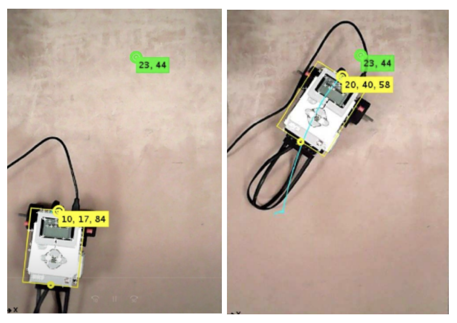
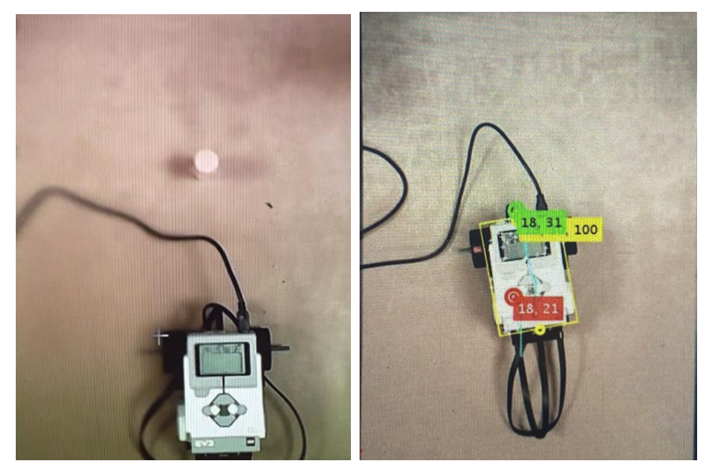
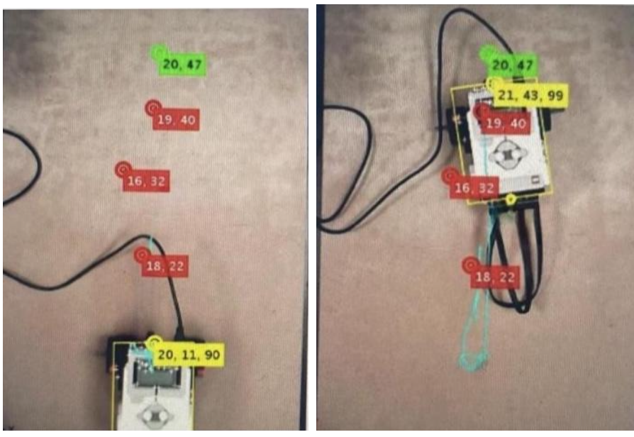

# Mobile Robot Path Planning using Artificial Potential Fields

## Project Overview
This project demonstrates the implementation of the Artificial Potential Field (APF) algorithm for autonomous mobile robot path planning and obstacle avoidance. The system guides a differential drive robot (LEGO EV3) to a specified goal while avoiding detected obstacles in a real-time environment. A fixed camera tracks the robot and surrounding elements, providing essential position data for the algorithm's calculations.

## Key Features & Concepts
* **Artificial Potential Field (APF) Algorithm:** Utilizes attractive forces to pull the robot towards its goal and repulsive forces to push it away from obstacles.
* **Real-time Robot Tracking:** Employs a webcam and MATLAB's Computer Vision Toolbox for real-time tracking of the robot's position and orientation, as well as the locations of the goal and obstacles.
* **Differential Drive Robot Control:** Translates the calculated total forces into linear and angular velocities, which are then used to control the speeds of the left and right motors of a LEGO EV3 robot.
* **Parameter Tuning:** Explores the impact of various algorithm parameters, including attraction gain (`katt`), repulsion gain (`krep`), angular velocity gain (`ktheta`), and critical distance (`rho0`), on the robot's navigation behavior.
* **Diverse Test Scenarios:** The algorithm's effectiveness was evaluated across different environmental setups:
    * Path planning with no obstacles.
    * Path planning with a single obstacle.
    * Path planning with multiple obstacles.

## Mathematical Formulation
The core of the Artificial Potential Field algorithm involves calculating attractive and repulsive forces that act upon the robot.

### Attractive Force
The attractive force ($F_{att}$) guides the robot towards its designated goal:
$$F_{att}=-k_{att}(q-q_{goal})$$
where:
* $k_{att}$ is the attraction gain.
* $q$ is the robot's current position vector.
* $q_{goal}$ is the goal position vector.

### Repulsive Force
The repulsive force ($F_{rep}$) pushes the robot away from obstacles when it enters their influence zone:

where:
* $k_{rep}$ is the repulsion gain.
* $\rho(q)$ is the minimum distance from the robot to the obstacle.
* $\rho_0$ is the critical distance, defining the obstacle's influence radius.
* $q_{obst}$ is the obstacle's position vector.

The distance $\rho(q)$ is calculated as:
$$\rho(q)=\sqrt{(q(1)-q_{obst}(1))^{2}+(q(2)-q_{obst}(2))^{2}}$$

## Setup & Requirements
* **Hardware:**
    * MATLAB-compatible webcam
    * LEGO EV3 Intelligent Brick
    * LEGO EV3 Differential Drive Robot (assembled with motors connected to ports B and C)
* **Software:**
    * MATLAB (with Image Processing Toolbox and Computer Vision Toolbox)
    * LEGO MINDSTORMS EV3 Support Package for MATLAB

## How to Run the Project
1.  **Hardware Connection:** Ensure your LEGO EV3 brick is powered on and connected to your computer (via USB or Bluetooth). Connect the webcam and verify it's recognized by MATLAB.
2.  **Physical Setup:** Place the assembled LEGO EV3 robot on a flat, clear surface within the webcam's field of view.
3.  **Initialization:**
    * Open MATLAB and navigate to the `code/` directory of this project.
    * Run the `trackinit.m` script. This script will connect to the EV3, initialize the camera, and guide you through selecting the robot, goal point, and any obstacles by clicking on the live camera feed.
4.  **Execute Path Planning:**
    * Open the `main.m` script.
    * **Crucially, ensure the `alpha` variable is defined before running. For example, add `alpha = 1;` below the `calib` definition.**
    * You can adjust the parameters `katt`, `krep`, `ktheta`, and `rho0` within `main.m` to observe their effects on robot behavior.
    * Run `main.m`. The robot will begin to navigate towards the selected goal, avoiding obstacles.
5.  **Stop Execution:** To stop the robot and the program, press the 'up' button on the LEGO EV3 brick.

## Project Demonstrations (Visual Results)
The robot's navigation capabilities were observed and documented through various scenarios.

### Test 1: Navigation without Obstacles
The robot followed a smooth, curving path directly to the goal. Its speed naturally decreased as it approached the target, demonstrating the attractive force's primary influence.

### Test 2: Navigation with a Single Obstacle
When a single obstacle was introduced, the robot successfully deviated from its direct course to maneuver around it before proceeding to the goal. Appropriate tuning of the repulsion gain (`krep`) was critical to prevent collisions.

### Test 3: Navigation with Multiple Obstacles
Navigating complex environments with multiple obstacles required careful optimization of both repulsion and angular velocity gains to ensure the robot could effectively weave through the obstacles and reach its destination without collisions.

## Observations & Insights
* **Gain Impact:** The `katt` gain directly influenced the robot's speed towards the goal. Higher `krep` values resulted in stronger obstacle avoidance, while `ktheta` impacted the sharpness of the robot's turns and its responsiveness to orientation errors.
* **Critical Distance (`rho0`):** Setting `rho0` to 4 (cm) effectively initiated repulsive forces when the robot was approximately within its physical "radius" from an obstacle, allowing for timely avoidance maneuvers.
* **Environmental Factors:** Camera quality (blurriness at corners) and ambient lighting conditions significantly impacted the accuracy of robot and obstacle detection, which in turn affected the system's overall performance. These external factors can necessitate recalibration or adjustment of algorithm parameters.

## Code Files
* `main.m`: Contains the primary logic for the potential field algorithm, force calculations, and robot motor control.
* `tracker.m`: Manages real-time camera feed processing, object tracking, and visual annotations displayed to the user.
* `trackinit.m`: Handles the initial setup, including LEGO EV3 connection, webcam initialization, and user-guided selection of the robot, goal, and obstacle points.

## Author
Rawan Basem

